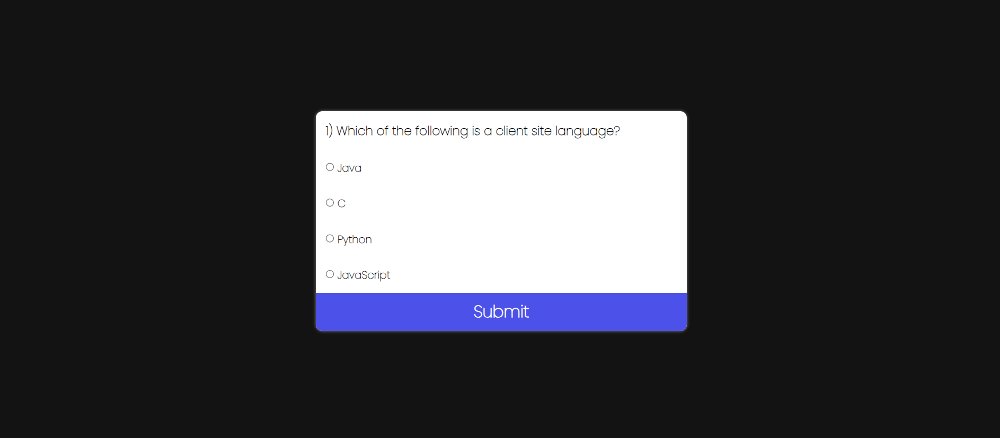

# Quiz App

## Description
The Quiz App is a web-based application that allows users to take a quiz consisting of multiple-choice questions. The questions are presented one by one, and users can select their answers from the provided options. After completing the quiz, users receive their score based on the number of correct answers.

## Technologies Used
- HTML
- CSS
- JavaScript

## Features
- Multiple-choice questions with four options each.
- Real-time score tracking.
- Ability to navigate through questions and submit answers.
- Feedback on the final score after completing the quiz.

## JavaScript Learnings
The JavaScript code for this app demonstrates several key concepts, including:
- **Data Handling**: Storing quiz questions and answers in an array of objects.
- **DOM Manipulation**: Dynamically loading questions and options onto the webpage based on user interactions.
- **Event Handling**: Utilizing event listeners to respond to user actions such as clicking the submit button.
- **Scoring Logic**: Calculating the user's score based on their selected answers and providing feedback on completion.

## Screenshots

## Author
This project is created by Vishal Pandey.
